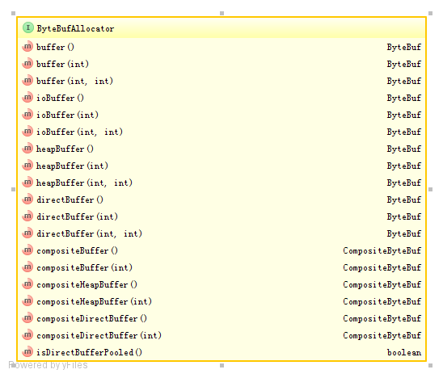
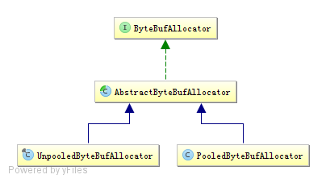
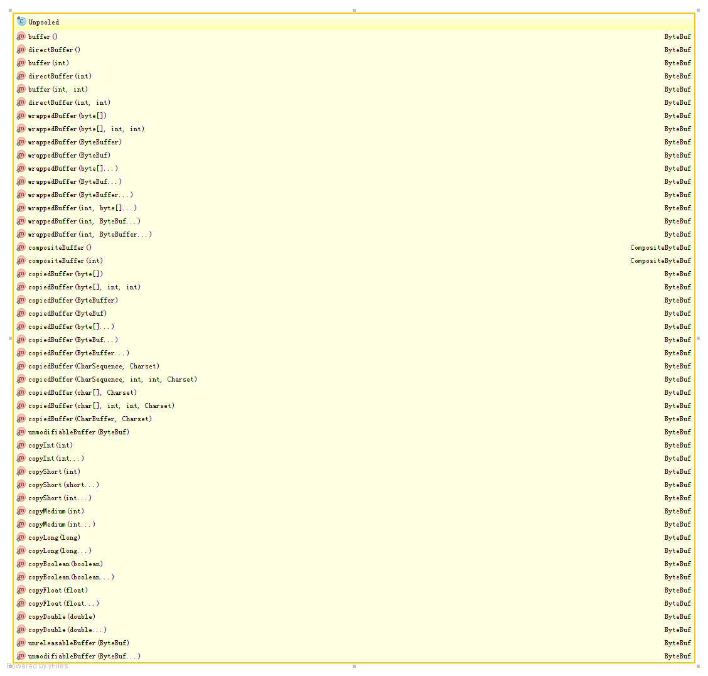
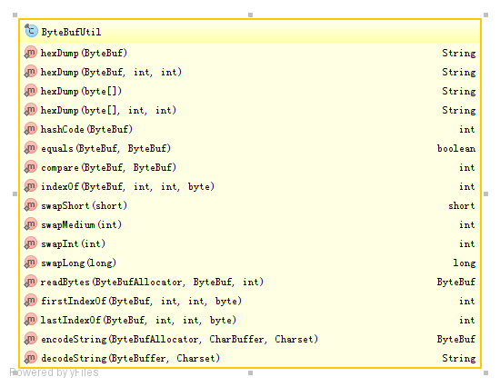

### ByteBuf
ByteBuf的三种类型：

1. Heap Buffer：数据存储在堆中。

*访问堆中的数组*

<pre>
    ByteBuf heapBuf = Unpooled.buffer(10);
    //wirte data
    if (heapBuf.hasArray()) {
        byte[] array = heapBuf.array();
        int offset = heapBuf.arrayOffset() + heapBuf.capacity();
        int length = heapBuf.readableBytes();
        
        //do something
    }
</pre>

2. Direct Buffer：数据存储在内存中（不属于堆内存）

*访问内存中的数据*

<pre>
    ByteBuf directBuffer = Unpooled.directBuffer(10);
    for (int i = 1; i < 15; i ++) {
        directBuffer.writeByte(i);
    }
    if (!directBuffer.hasArray()) {
        int length = directBuffer.readableBytes();
        byte[] array = new byte[length];
        directBuffer.getBytes(0, array);
        for (int j = 0; j < length; j ++) {
            System.out.print(array[j] + " ");
        }
    }
</pre>

3. Composite Buffer：将不同的ByteBuf组合在一起，提供一个统一的视图

       +-----+-----+-----+-------+
       |    Composite Buffer     |
       |   +-----+-----+-----+   |
       |   | Header | Body   |   |
       |   +-----+-----+-----+   |
       |                         |
       +-----+-----+-----+-------+	   
	   
	   
<pre>
    CompositeByteBuf compositeBuf = Unpooled.compositeBuffer();
    ByteBuf header = Unpooled.buffer(4);
    ByteBuf body = Unpooled.buffer();
    compositeBuf.addComponents(header, body);
</pre>

#### ByteBuf的逻辑结构

      +--------------------------------------------------------+
      | discardable bytes | readable bytes   | writable bytes  |
      +--------------------------------------------------------+
    + 0      <=      readerIndex     <=    writerIndex  <=      capacity
    

### 操作
#### 通过getXxx()访问

<pre>
ByteBuf buf = Unpooled.directBuffer();
for (int i = 0; i < 10; i ++) {
    buf.writeByte((byte)i);
}
for (int i = 0; i < buf.capacity(); i ++) {
    byte b = buf.getByte(i);
    System.out.println(b);
}
</pre>

getXxx()函数并不会修改readerIndex

#### 通过readXxx()读取

<pre>
ByteBuf buf = Unpooled.directBuffer();
for (int i = 0; i < 10; i ++) {
    buf.writeByte((byte)i);
}
int length = buf.readableBytes();
for (int i = 0; i < length; i ++) {
    System.out.println(buf.readByte());
}
</pre>

#### discardable bytes
discardable bytes包含了已经被readXxx方法读取的字节。可以使用discardReadBytes()方法清除这些数据。

      +--------------------------------------------------------+
      | readable bytes | writable bytes                        |
      +--------------------------------------------------------+
    + readerIndex(=0)<=writerIndex       <=                    capacity
    
    
<pre>
ByteBuf buf = Unpooled.directBuffer();
for (int i = 0; i < 10; i++) {
    buf.writeByte((byte) i);
}
buf.readByte();
buf.readByte();

System.out.println("capacity：" + buf.capacity());
System.out.println("readerIndex：" + buf.readerIndex());
System.out.println("writerIndex：" + buf.writerIndex());
System.out.println("readableBytes：" + buf.readableBytes());

buf.discardReadBytes();
System.out.println("capacity：" + buf.capacity());
System.out.println("readerIndex：" + buf.readerIndex());
System.out.println("writerIndex：" + buf.writerIndex());
System.out.println("readableBytes：" + buf.readableBytes());
</pre>

discardReadBytes()会移动缓冲区的数据，会带来一些性能损耗。

#### readXxx()、writeXxx()、isReadable()、isWritable()

<pre>
    ByteBuf buf = Unpooled.directBuffer(10);
    int i = 1;
    while (buf.isWritable()) {
        buf.writeByte((byte) i);
        i ++;
    }
   while (buf.isReadable()) {
       System.out.println(buf.readByte());
   }
   
   ByteBuf buf = Unpooled.directBuffer(10);
   int i = 1;
   while (buf.writableBytes() >= 4) {
       buf.writeInt(i);
       i ++;
   }
   while (buf.readableBytes() >= 4) {
       System.out.println(buf.readInt());
   }
</pre>

#### mark()、reset()

<pre>
ByteBuf buf = Unpooled.buffer();
buf.writeInt(1);
buf.markWriterIndex();

buf.writeLong(2);
buf.readInt();
buf.markReaderIndex();

System.out.println("readerIndex：" + buf.readerIndex());
System.out.println("writerIndex：" + buf.writerIndex());

buf.readLong();
System.out.println("readerIndex：" + buf.readerIndex());
System.out.println("writerIndex：" + buf.writerIndex());

buf.resetReaderIndex();
buf.resetWriterIndex();
System.out.println("readerIndex：" + buf.readerIndex());
System.out.println("writerIndex：" + buf.writerIndex());

buf.readerIndex(2);
buf.writerIndex(2);
System.out.println("readerIndex：" + buf.readerIndex());
System.out.println("writerIndex：" + buf.writerIndex());
</pre>

#### Derived buffers
使用duplicate()、slice()、order(ByteOrder)创建视图

duplicate()：复制一个ByteBuf，与被复制的ByteBuf共享一个数组，但是分别维护各自的writerIndex和readerIndex

<pre>
ByteBuf buf = Unpooled.buffer(10);
for (int i = 0; i < 9; i++) {
    buf.writeByte((byte) i);
}
System.out.println("buf readerIndex：" + buf.readerIndex());
System.out.println("buf writerIndex：" + buf.writerIndex());
ByteBuf duplicated = buf.duplicate();
System.out.println("duplicated readerIndex：" + duplicated.readerIndex());
System.out.println("duplicated writerIndex：" + duplicated.writerIndex());

if (buf.hasArray()) {
    byte[] array = buf.array();
    for (int i = 0; i < array.length;i ++) {
        System.out.print(array[i] + " ");
    }
}
System.out.println();

buf.writeByte(9);
System.out.println("buf readerIndex：" + buf.readerIndex());
System.out.println("buf writerIndex：" + buf.writerIndex());
System.out.println("duplicated readerIndex：" + duplicated.readerIndex());
System.out.println("duplicated writerIndex：" + duplicated.writerIndex());

if (duplicated.hasArray()) {
    byte[] array = duplicated.array();
    for (int i = 0; i < array.length;i ++) {
        System.out.print(array[i] + " ");
    }
}
</pre>

slice()：复制一个只读ByteBuf，与被复制的ByteBuf共享一个数组

<pre>
ByteBuf buf = Unpooled.copiedBuffer("Hello world!", CharsetUtil.UTF_8);
ByteBuf sliced1 = buf.slice();
ByteBuf sliced2 = buf.slice(6, 12);

Assert.assertTrue(buf.isWritable());
Assert.assertFalse(sliced1.isWritable());
Assert.assertFalse(sliced2.isWritable());

while (buf.isReadable()) {
    System.out.print((char) buf.readByte());
}
System.out.println();
while (sliced1.isReadable()) {
    System.out.print((char) sliced1.readByte());
}
System.out.println();
while (sliced2.isReadable()) {
    System.out.print((char) sliced2.readByte());
}
System.out.println();

buf.writeByte((char) '?');
Assert.assertTrue(buf.isReadable());
Assert.assertFalse(sliced1.isReadable());
Assert.assertFalse(sliced2.isReadable());
</pre>

order()：复制一个只读ByteBuf，与被复制的ByteBuf共享一个数组，维护同一个的writerIndex和readerIndex

<pre>
ByteBuf buf = Unpooled.buffer();
ByteBuf bigOrder = buf.order(ByteOrder.BIG_ENDIAN);
ByteBuf littleOrder = buf.order(ByteOrder.LITTLE_ENDIAN);

buf.writeInt(1);

Assert.assertEquals(buf.writerIndex(), bigOrder.writerIndex());
Assert.assertEquals(buf.writerIndex(), littleOrder.writerIndex());

System.out.println(buf.getInt(0));
System.out.println(bigOrder.getInt(0));
System.out.println(littleOrder.getInt(0));

Assert.assertTrue(buf.isReadable());
Assert.assertTrue(bigOrder.isReadable());
Assert.assertTrue(littleOrder.isReadable());

bigOrder.readInt();

Assert.assertEquals(buf.readerIndex(), bigOrder.readerIndex());
Assert.assertEquals(buf.readerIndex(), littleOrder.readerIndex());

Assert.assertFalse(buf.isReadable());
Assert.assertFalse(bigOrder.isReadable());
Assert.assertFalse(littleOrder.isReadable());
</pre>

copy()：复制一个独立的ByteBuf

<pre>
ByteBuf buf = Unpooled.copiedBuffer("Hello world!", CharsetUtil.UTF_8);
ByteBuf copied = buf.copy();

buf.setByte(0, (char) 'h');

Assert.assertEquals('h', buf.readByte());
Assert.assertEquals('H', copied.readByte());
</pre>

#### getXxx()和setXxx()方法
getXxx()和setXxx()方法不会修改readerIndex和writerIndex

<pre>
ByteBuf buf = Unpooled.copiedBuffer("Hello world!", CharsetUtil.UTF_8);

int readerIndex = buf.readerIndex();
int writerIndex = buf.writerIndex();

buf.getByte(1);
buf.setByte(0, (char) 'h');

Assert.assertEquals(readerIndex, buf.readerIndex());
Assert.assertEquals(writerIndex, buf.writerIndex());
</pre>

#### readXxx()和writeXxx()方法

<pre>
ByteBuf buf = Unpooled.copiedBuffer("Hello world!", CharsetUtil.UTF_8);

int readerIndex = buf.readerIndex();
int writerIndex = buf.writerIndex();

buf.readByte();
buf.writeByte((char) 'h');

Assert.assertNotEquals(readerIndex, buf.readerIndex());
Assert.assertNotEquals(writerIndex, buf.writerIndex());
</pre>

#### capacity()、maxCapacity()

<pre>
ByteBuf buf = Unpooled.buffer();
System.out.println(buf.maxCapacity());
System.out.println(buf.capacity());
</pre>

### ByteBufHolder
ByteBufHolder是一个辅助类，是一个接口，其实现类是DefaultByteBufHolder，还有一些实现了ByteBufHolder接口的其他接口类。ByteBufHolder的作用就是帮助更方便的访问ByteBuf中的数据，当缓冲区没用了后，可以使用这个辅助类释放资源。ByteBufHolder很简单，提供的可供访问的方法也很少。如果你想实现一个“消息对象”有效负载存储在ByteBuf，使用ByteBufHolder是一个好主意。

#### content() 
Return the ByteBuf that holds the data

#### copy() 
Make a copy of the ByteBufHolder that does not share its data (so the data is also copied).

#### duplicate()
Duplicate the ByteBufHolder.

### ByteBufAllocator
ByteBuf的工厂方法，负责分配ByteBuf实例，ByteBufAllocator提供了各种分配不同ByteBuf的方法。

*ByteBufAllocator的方法* 

*ByteBufAllocator层次关系* 

PooledByteBufAllocator：实现ByteBuf实例池将分配和回收成本以及内存使用降到最低

UnpooledByteBufAllocator：是每次使用都创建一个新的ByteBuf实例

Netty默认使用PooledByteBufAllocator

### Unpooled
Unpooled提供了不使用ByteBuf实例池的辅助工具

### ByteBufUtil
ByteBuf的辅助方法

