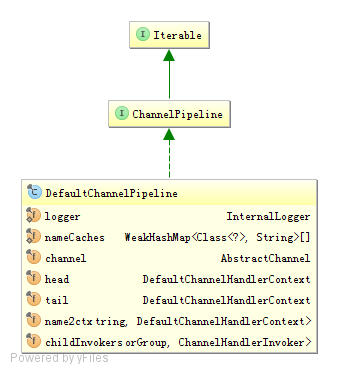

红色表示还未看到的地方

ChannelPipeline维护了一组ChannelHandler的链表关系。
ChannelPipeline实现了拦截器模式，让用户可以在ChannelPipeline中完全控制一个事件及如何处理ChannelHandler与ChannelPipeline的交互。

每个通道在创建时，都会自动创建一个新的的ChannelPipeline并附加在通道上。

ChannelPipeline的类图

DefaultChannelPipeline是ChannelPipeline接口的默认实现。

# 属性
## InternalLogger logger 日志
## AbstractChannel channel 通道
## WeakHashMap<Class<?>, String>[] nameCaches
Handler名字的缓存
## DefaultChannelHandlerContext head
头结点
## DefaultChannelHandlerContext tail
尾结点
## Map<String, DefaultChannelHandlerContext> name2ctx
保存Handler的名字，每个handler在ChannelPipeline中都有一个与之对应的名字。在添加Handler的时候，如果没有指定名字，会调用generateName(ChannelHandler handler)方法创建一个名字
## Map<EventExecutorGroup, ChannelHandlerInvoker> childInvokers
保存ChannelHandlerInvoker与EventExecutorGroup的关系

# 构造函数
DefaultChannelPipeline建立了head和tail的双向链表关系

<pre>
head.next = tail;
tail.prev = head;
</pre>

# addFirst(String name, ChannelHandler handler)

1. 通过name2ctx.containsKey(name)检查name的合法性，如果name2ctx中已经存在name，抛出IllegalArgumentException
2. 为handler创建一个新的context。DefaultChannelHandlerContext newCtx = new DefaultChannelHandlerContext(this, invoker, name, handler);
3. 将newCtx插入到链表中

    3.1 检查context的有效性，如果context对应的handler未被声明为共享，那么这个handler只允许被添加到pipeline中一次

    <pre>
    private static void checkMultiplicity(ChannelHandlerContext ctx) {
            ChannelHandler handler = ctx.handler();
            if (handler instanceof ChannelHandlerAdapter) {
                ChannelHandlerAdapter h = (ChannelHandlerAdapter) handler;
                if (!h.isSharable() && h.added) {
                    throw new ChannelPipelineException(
                            h.getClass().getName() +
                            " is not a @Sharable handler, so can't be added or removed multiple times.");
                }
                h.added = true;
            }
        }
    </pre>

    3.2 将newCtx插入到链表合适的位置
    3.3 将name保存到name2ctx中
    3.4 调用callHandlerAdded(final DefaultChannelHandlerContext ctx)</code>方法

# callHandlerAdded(final DefaultChannelHandlerContext ctx)

# findInvoker(EventExecutorGroup group)
childInvokers中取出group对应的invoker，如果不存在对应的invoker则创建一个

# generateName(ChannelHandler handler)
根据handler生成对应的名字
nameCaches用来减少锁的竞争

<pre>
        WeakHashMap<Class<?>, String> cache = nameCaches[(int) (Thread.currentThread().getId() % nameCaches.length)];
        Class<?> handlerType = handler.getClass();
        String name;
        synchronized (cache) {
            name = cache.get(handlerType);
            if (name == null) {
                name = StringUtil.simpleClassName(handlerType) + "#0";
                cache.put(handlerType, name);
            }
        }
</pre>

# Inbound Event:
    调用header

   fireChannelRegistered()
   fireChannelActive()
   fireChannelRead(Object)
   fireChannelReadComplete()
   fireExceptionCaught(Throwable)
   fireUserEventTriggered(Object)
   fireChannelWritabilityChanged()
   fireChannelInactive()

# Outbound Event:
    调用tail

      bind(SocketAddress, ChannelPromise)
      connect(SocketAddress, SocketAddress, ChannelPromise)
      write(Object, ChannelPromise)
      flush()
      read()
      disconnect(ChannelPromise)
      close(ChannelPromise)

# HeadHandler对Inbound事件的调用

<pre>
    @Override
    public ChannelHandlerContext fireChannelRead(Object msg) {
        DefaultChannelHandlerContext next = findContextInbound(MASK_CHANNEL_READ);
        next.invoker.invokeChannelRead(next, msg);
        return this;
    }
</pre>
